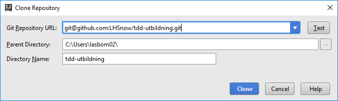

# TDD-utbildning

Testdriven utveckling för med Scrabble som exempelapplikation.

Det här dokumentet kommer fyllas på med inledande information till deltagarna. Annan detaljerad dokumentation finns i andra dokument, se länkar nedan.

- [Kursplan](plan.md)
- [Spelregler för Scrabble](http://scrabble.hasbro.com/en-us/rules)

## Övningar

- [Enhetstesta funktion](docs/funktion.md)
- [Refaktorisera](docs/refaktorisera.md)
- [Acceptanstest](docs/acceptanstest.md)
- [Mockning](docs/mockning.md)

## Kom igång

Följ instruktionerna nedan, antingen via IntelliJs menyer eller via ``kommandorad``. I det senare fallet kan du använda antingen git bash eller kommandotolken (windows).

1. Importera git-repositoryt i IntelliJ   
  - File > new > project from version control > git > ``git@github.com:LHSnow/tdd-utbildning.git``
    1. 
    2. 
  - ``git clone git@github.com:LHSnow/tdd-utbildning.git``
2. Byt branch till "canary"    
  - ``git checkout canary``
3. Importera projektet som ett maven-projekt  
  - Högerklicka på pom.xml i filträdet (alt+1) > Add Maven project
  
4. Ladda ner dess beroenden via IntelliJ:s maven-plugin
  - Build > build project > (eventuellt) välj SDK
  
  - ``mvn compile``

Om du hamnar efter i övningarna går det bra att ”spola framåt” i kodexemplen i git-repositoryt enligt punkt (2) och välja en annan startposition.

## Förberedelser

För att instruktionerna ovan ska fungera smidigt förutsätts följande ha förberetts innan utbildningen för alla deltagare.

1.	Git for Windows. Tanken är att använda IntelliJ till allt, men det är bra att ha kommandoradsstöd tillgängligt om något går fel.
2.	Github-användare, för att möjliggöra (3)
3.	Autentisering[*](#auth) till github, för att underlätta clone/pull
4.  Fungerande nätverk med access till Github och Maven central (eller annan mirror)
5.  JDK7
6.	IntelliJ med tillgång till
  1. git
  2. maven3
  4. jUnit4

<s id="auth">\*</s> IntelliJ har stöd för både användare+lösenord, api-tokens och ssh-nycklar. Det vore nog smart att använda samma metod under utbildningen som används i Gitlab lokalt. Vi lärare anpassar oss efter det och visar hur importen går till utifrån det sättet.
